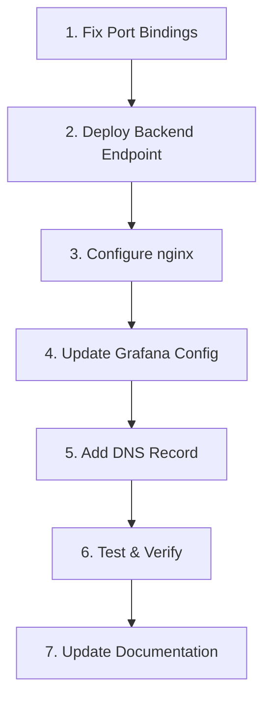

# Grafana Authentication Implementation Plan

**Project:** Rafiki Habits Tracker
**Date:** 2025-11-16
**Status:** Ready for Implementation
**Estimated Time:** 8-10 hours total

---

## Executive Summary

This document outlines the implementation plan for securing Grafana dashboard access using the existing Rafiki JWT authentication system. The analysis confirmed that **using the current authentication system is highly feasible** and recommended.

### Key Findings

✅ **Feasibility: YES - Highly Recommended**

- Existing JWT authentication system is production-ready
- ADMIN role enforcement already implemented via OPA
- Hetzner Cloud Firewall is already configured (ports 22, 80, 443)
- **Critical Security Gap:** Internal ports exposed to 0.0.0.0 (all interfaces)
- Grafana currently running with anonymous admin access (development mode)

### Recommended Approach

**nginx auth_request with JWT validation** - Leverages existing infrastructure with minimal code changes.

---

## Current State Analysis

### Infrastructure (Hetzner CPX11)

- **Server IP:** 178.156.170.37
- **Deployment:** Docker Compose on Ubuntu/Debian
- **Frontend:** Vercel (app.rafiki.lat)
- **Backend:** Hetzner (api.rafiki.lat)

### Current Port Exposure

| Port | Service | Current Binding | Status | Risk |
|------|---------|----------------|---------|------|
| 80 | nginx HTTP | `80:80` | Public (redirect) | ✅ Low |
| 443 | nginx HTTPS | `443:443` | Public (API) | ✅ Low |
| 3000 | API Server | `3000:3000` | **EXPOSED** | 🔴 HIGH |
| 3010 | Debug/Metrics | `3010:3010` | **EXPOSED** | 🔴 CRITICAL |
| 3100 | Grafana | `3100:3100` | **EXPOSED** | 🔴 HIGH |
| 3200 | Tempo Query | `3200:3200` | **EXPOSED** | 🟡 Medium |
| 4317 | OTLP gRPC | `4317:4317` | **EXPOSED** | 🟡 Medium |
| 5432 | PostgreSQL | No binding | Internal only | ✅ Secure |

### Current Grafana Configuration

```yaml
# docker-compose.yml - DEVELOPMENT MODE (INSECURE)
grafana:
  environment:
    - GF_AUTH_ANONYMOUS_ENABLED=true
    - GF_AUTH_ANONYMOUS_ORG_ROLE=Admin  # Anyone is admin
    - GF_AUTH_DISABLE_LOGIN_FORM=true
  ports:
    - "3100:3100"  # Exposed to internet
```

**Current Vulnerability:** Anyone who knows the server IP can access Grafana with admin privileges.

### Existing Authentication System

**Status:** Production-ready and robust

**Components:**
- JWT tokens with RS256 signing (RSA key pairs)
- 48-hour token expiration (configurable)
- Role-based authorization via Open Policy Agent (OPA)
- ADMIN and USER roles defined
- Bearer token middleware (`Authorization: Bearer <token>`)
- Database-backed user validation

**Files:**
- `app/sdk/auth/auth.go` - JWT validation and claims
- `app/sdk/mid/authen.go` - Bearer middleware
- `business/types/role/role.go` - Role definitions
- `app/sdk/auth/rego/authorization.rego` - OPA policies

---

## Security Issues Found

### Critical Issues

1. **Port Exposure Bypasses nginx**
   - Ports bound to `0.0.0.0` (all interfaces)
   - Direct access to port 3000 bypasses rate limiting, SSL, security headers
   - Port 3010 exposes debug endpoints (pprof, expvar) publicly
   - Port 3100 allows anonymous admin access to Grafana

2. **Grafana Anonymous Admin Access**
   - No authentication required
   - Full admin privileges
   - No audit trail

3. **Debug Endpoints Publicly Accessible**
   - Port 3010 exposes `/debug/pprof/` endpoints
   - Memory dumps, goroutine traces accessible

### Good News

✅ **Hetzner Cloud Firewall Already Configured**
- Only ports 22, 80, 443 allowed
- This provides first layer of defense
- However, defense-in-depth requires fixing port bindings

---

## Implementation Plan

### Phase 1: Emergency Security Fix (Priority: CRITICAL)
**Time Estimate:** 30 minutes

Fix port bindings to prevent bypass of firewall if misconfigured.

### Phase 2: Backend Authentication Endpoint
**Time Estimate:** 2 hours

Add `/v1/auth/verify-admin` endpoint for nginx validation.

### Phase 3: nginx Configuration
**Time Estimate:** 2 hours

Configure nginx reverse proxy with auth_request directive.

### Phase 4: Grafana Configuration
**Time Estimate:** 1 hour

Update Grafana to work behind authenticated nginx proxy.

### Phase 5: Testing & Verification
**Time Estimate:** 2 hours

Comprehensive testing of all scenarios.

### Phase 6: Documentation & Deployment
**Time Estimate:** 2 hours

Update guides and deploy to production.

---

## Backend Tasks

### Task 1: Extend JWT Token Lifetime (Optional)
**File:** `app/sdk/mid/authen.go`
**Line:** 73
**Change:** 48 hours → 168 hours (7 days)

**Rationale:**
- Single admin user scenario
- Longer lifetime improves UX
- Still requires weekly re-authentication
- Firewall-protected environment reduces risk

```go
// BEFORE
ExpiresAt: jwt.NewNumericDate(time.Now().UTC().Add(48 * time.Hour)),

// AFTER
ExpiresAt: jwt.NewNumericDate(time.Now().UTC().Add(168 * time.Hour)),
```

### Task 2: Create Admin Verification Endpoint
**Files to Create/Modify:**
- `app/domain/authapp/authapp.go` (add method)
- `app/domain/authapp/route.go` (add route)
- `app/domain/authapp/model.go` (add response struct)

#### Implementation

**File:** `app/domain/authapp/authapp.go`

```go
// Add to app struct methods

var (
    ErrNotAdmin = errors.New("admin role required")
)

func (a *app) verifyAdmin(ctx context.Context, r *http.Request) web.Encoder {
    // Bearer middleware already validated token
    claims := mid.GetClaims(ctx)

    // Parse user ID
    userID, err := uuid.Parse(claims.Subject)
    if err != nil {
        return errs.Newf(errs.Unauthenticated, "invalid user id in token")
    }

    // Verify ADMIN role using existing OPA authorization
    if err := a.auth.Authorize(ctx, claims, userID, auth.RuleAdminOnly); err != nil {
        log.Info(ctx, "admin-verification-failed",
            "userID", claims.Subject, "roles", claims.Roles)
        return errs.New(errs.Unauthenticated, ErrNotAdmin)
    }

    // Log successful admin access (security audit)
    log.Info(ctx, "admin-verification-success",
        "userID", claims.Subject, "endpoint", "grafana")

    return AdminVerification{
        UserID: claims.Subject,
        Roles:  claims.Roles,
    }
}
```

**File:** `app/domain/authapp/model.go`

```go
// Add response model
type AdminVerification struct {
    UserID string   `json:"user_id"`
    Roles  []string `json:"roles"`
}
```

**File:** `app/domain/authapp/route.go`

```go
func Routes(app *web.App, cfg Config) {
    const version = "v1"

    basic := mid.Basic(cfg.Auth, cfg.UserBus)
    bearer := mid.Bearer(cfg.Auth)

    api := newApp(cfg.Auth)

    // Existing route
    app.HandlerFunc(http.MethodGet, version, "/auth/token/{kid}", api.token, basic)

    // NEW: Admin verification for nginx auth_request
    app.HandlerFunc(http.MethodGet, version, "/auth/verify-admin",
        api.verifyAdmin, bearer)
}
```

### Task 3: Unit Tests
**File:** `app/domain/authapp/authapp_test.go` (create)

```go
package authapp_test

import (
    "context"
    "net/http"
    "net/http/httptest"
    "testing"
)

func TestVerifyAdmin_ValidAdmin(t *testing.T) {
    // Test with valid admin JWT token
    // Expected: 200 OK
}

func TestVerifyAdmin_ValidUserNotAdmin(t *testing.T) {
    // Test with valid user (non-admin) JWT token
    // Expected: 403 Forbidden
}

func TestVerifyAdmin_InvalidToken(t *testing.T) {
    // Test with invalid/malformed JWT token
    // Expected: 401 Unauthorized
}

func TestVerifyAdmin_ExpiredToken(t *testing.T) {
    // Test with expired JWT token
    // Expected: 401 Unauthorized
}

func TestVerifyAdmin_NoAuthHeader(t *testing.T) {
    // Test without Authorization header
    // Expected: 401 Unauthorized
}
```

---

## DevOps Tasks

### Task 1: Fix Port Bindings (CRITICAL)
**File:** `docker-compose.yml`

**Changes Required:**

```yaml
services:
  partner-service:
    ports:
      # BEFORE: - "3000:3000"
      # AFTER:
      - "127.0.0.1:3000:3000"   # API - localhost only
      - "127.0.0.1:3010:3010"   # Debug - localhost only

  grafana:
    ports:
      # BEFORE: - "3100:3100"
      # AFTER:
      - "127.0.0.1:3100:3100"   # Grafana - localhost only

  tempo:
    ports:
      # BEFORE: - "3200:3200" and - "4317:4317"
      # AFTER:
      - "127.0.0.1:3200:3200"   # Tempo query - localhost only
      - "127.0.0.1:4317:4317"   # OTLP gRPC - localhost only
```

**Impact:**
- ✅ Prevents public access even if firewall fails
- ✅ nginx still works (uses Docker internal network)
- ✅ SSH tunnels still work for debugging
- ❌ No breaking changes to functionality

### Task 2: nginx Grafana Configuration
**File:** `nginx/nginx.conf`

Add new server block for Grafana:

```nginx
# ==================================================================
# Grafana Protected Access
# ==================================================================
server {
    listen 443 ssl;
    listen [::]:443 ssl;
    http2 on;
    server_name grafana.rafiki.lat;

    # SSL certificates (Let's Encrypt)
    ssl_certificate /etc/letsencrypt/live/api.rafiki.lat/fullchain.pem;
    ssl_certificate_key /etc/letsencrypt/live/api.rafiki.lat/privkey.pem;

    # SSL configuration
    ssl_protocols TLSv1.2 TLSv1.3;
    ssl_ciphers 'ECDHE-ECDSA-AES128-GCM-SHA256:ECDHE-RSA-AES128-GCM-SHA256:ECDHE-ECDSA-AES256-GCM-SHA384:ECDHE-RSA-AES256-GCM-SHA384';
    ssl_prefer_server_ciphers off;
    ssl_session_cache shared:SSL:10m;
    ssl_session_timeout 10m;

    # Security headers
    add_header Strict-Transport-Security "max-age=31536000; includeSubDomains" always;
    add_header X-Content-Type-Options "nosniff" always;
    add_header X-Frame-Options "SAMEORIGIN" always;

    # Grafana proxy with authentication
    location / {
        # Authenticate via backend
        auth_request /auth-verify;

        # On auth failure, return error
        error_page 401 403 = @auth_error;

        # Proxy to Grafana
        proxy_pass http://grafana:3100;
        proxy_set_header Host $host;
        proxy_set_header X-Real-IP $remote_addr;
        proxy_set_header X-Forwarded-For $proxy_add_x_forwarded_for;
        proxy_set_header X-Forwarded-Proto $scheme;

        # WebSocket support for Grafana live features
        proxy_http_version 1.1;
        proxy_set_header Upgrade $http_upgrade;
        proxy_set_header Connection "upgrade";
    }

    # Internal auth verification endpoint
    location = /auth-verify {
        internal;  # Only callable by nginx

        # Extract token from URL parameter or Authorization header
        set $token $http_authorization;
        if ($arg_token != "") {
            set $token "Bearer $arg_token";
        }

        # Forward to backend auth endpoint
        proxy_pass http://partner-service:3000/v1/auth/verify-admin;
        proxy_pass_request_body off;
        proxy_set_header Content-Length "";
        proxy_set_header Authorization $token;
    }

    # Auth error response
    location @auth_error {
        default_type application/json;
        return 401 '{"error":"Unauthorized - Admin authentication required","hint":"Get token: curl -u admin@rafiki.lat:password https://api.rafiki.lat/v1/auth/token/{kid}"}';
    }
}
```

### Task 3: Update Grafana Configuration
**File:** `docker-compose.yml`

```yaml
grafana:
  image: grafana/grafana:12.2.0
  container_name: rafiki-grafana
  restart: unless-stopped
  environment:
    # Keep anonymous mode (security handled by nginx)
    - GF_AUTH_ANONYMOUS_ENABLED=true
    - GF_AUTH_ANONYMOUS_ORG_ROLE=Admin
    - GF_AUTH_DISABLE_LOGIN_FORM=true

    # Server configuration for reverse proxy
    - GF_SERVER_HTTP_PORT=3100
    - GF_SERVER_ROOT_URL=https://grafana.rafiki.lat
    - GF_SERVER_SERVE_FROM_SUB_PATH=false

    # Security
    - GF_ANALYTICS_REPORTING_ENABLED=false
    - GF_ANALYTICS_CHECK_FOR_UPDATES=false
    - GF_SNAPSHOTS_EXTERNAL_ENABLED=false

    # Features
    - GF_FEATURE_TOGGLES_ENABLE=traceqlEditor

  ports:
    - "127.0.0.1:3100:3100"  # CHANGED: localhost only

  volumes:
    - ./zarf/compose/grafana-datasources.yaml:/etc/grafana/provisioning/datasources/datasources.yaml:ro
    - grafana_data:/var/lib/grafana

  networks:
    rafiki-network:
      ipv4_address: 10.10.0.21
```

### Task 4: DNS Configuration

Add DNS record for Grafana subdomain:

```
Type: A
Name: grafana
Value: 178.156.170.37
TTL: 3600
```

Or use CNAME if preferred:

```
Type: CNAME
Name: grafana
Value: api.rafiki.lat
TTL: 3600
```

### Task 5: Create Helper Scripts

#### Script 1: Get Admin Token
**File:** `zarf/get-admin-token.sh`

```bash
#!/bin/bash

set -e

echo "========================================="
echo "Get Admin JWT Token"
echo "========================================="
echo ""

# Get Key ID
KID=$(ls /opt/rafiki/keys/*.pem 2>/dev/null | head -1 | xargs basename .pem)

if [ -z "$KID" ]; then
    echo "Error: No JWT keys found"
    exit 1
fi

echo "Key ID: $KID"
echo ""

# Prompt for credentials
read -p "Admin email [admin@rafiki.lat]: " EMAIL
EMAIL=${EMAIL:-admin@rafiki.lat}

read -sp "Admin password: " PASSWORD
echo ""
echo ""

# Get token
echo "Requesting token..."
RESPONSE=$(curl -s -u "$EMAIL:$PASSWORD" https://api.rafiki.lat/v1/auth/token/$KID)

TOKEN=$(echo "$RESPONSE" | jq -r .token)

if [ "$TOKEN" = "null" ] || [ -z "$TOKEN" ]; then
    echo "Error: Failed to get token"
    echo "Response: $RESPONSE"
    exit 1
fi

echo "========================================="
echo "✅ Token Generated Successfully"
echo "========================================="
echo ""
echo "Your JWT token (valid for 168 hours / 7 days):"
echo ""
echo "$TOKEN"
echo ""
echo "Access Grafana:"
echo "https://grafana.rafiki.lat?token=$TOKEN"
echo ""

# Show expiration
EXP=$(echo "$TOKEN" | cut -d. -f2 | base64 -d 2>/dev/null | jq -r .exp)
if [ "$EXP" != "null" ]; then
    EXP_DATE=$(date -d "@$EXP" 2>/dev/null || date -r "$EXP" 2>/dev/null)
    echo "Token expires: $EXP_DATE"
fi
```

#### Script 2: Verify Port Security
**File:** `devops/verify-port-security.sh`

```bash
#!/bin/bash

echo "========================================="
echo "Port Security Verification"
echo "========================================="

GREEN='\033[0;32m'
RED='\033[0;31m'
NC='\033[0m'

# Test internal Docker network
echo ""
echo "1. Testing Docker internal network..."
docker compose exec nginx wget -qO- http://partner-service:3000/v1/readiness > /dev/null 2>&1
if [ $? -eq 0 ]; then
    echo -e "${GREEN}✅${NC} Nginx can reach partner-service"
else
    echo -e "${RED}❌${NC} Nginx cannot reach partner-service"
    exit 1
fi

# Test localhost access
echo ""
echo "2. Testing localhost access..."
curl -sf http://localhost:3000/v1/readiness > /dev/null 2>&1
if [ $? -eq 0 ]; then
    echo -e "${GREEN}✅${NC} Port 3000 accessible via localhost"
else
    echo -e "${RED}❌${NC} Port 3000 not accessible via localhost"
    exit 1
fi

# Test public access blocked
echo ""
echo "3. Testing public port blocking..."
SERVER_IP=$(hostname -I | awk '{print $1}')
timeout 3 curl http://$SERVER_IP:3000 > /dev/null 2>&1
if [ $? -ne 0 ]; then
    echo -e "${GREEN}✅${NC} Port 3000 NOT publicly accessible (GOOD!)"
else
    echo -e "${RED}⚠️${NC}  WARNING: Port 3000 is publicly accessible!"
fi

echo ""
echo "========================================="
echo "✅ All checks passed!"
echo "========================================="
```

#### Script 3: Verify Grafana Auth
**File:** `devops/verify-grafana-auth.sh`

```bash
#!/bin/bash

echo "========================================="
echo "Grafana Authentication Verification"
echo "========================================="

GREEN='\033[0;32m'
RED='\033[0;31m'
NC='\033[0m'

# Test 1: Auth endpoint exists
echo ""
echo "Test 1: Backend auth endpoint..."
STATUS=$(curl -s -o /dev/null -w "%{http_code}" http://localhost:3000/v1/auth/verify-admin)
if [ "$STATUS" = "401" ]; then
    echo -e "${GREEN}✅${NC} Endpoint exists and requires authentication"
else
    echo -e "${RED}❌${NC} Endpoint returned $STATUS (expected 401)"
fi

# Test 2: Grafana port blocked
echo ""
echo "Test 2: Grafana port 3100 blocked publicly..."
timeout 3 curl http://$(hostname -I | awk '{print $1}'):3100 > /dev/null 2>&1
if [ $? -ne 0 ]; then
    echo -e "${GREEN}✅${NC} Port 3100 not publicly accessible"
else
    echo -e "${RED}⚠️${NC}  WARNING: Port 3100 is publicly accessible"
fi

# Test 3: Grafana via nginx requires auth
echo ""
echo "Test 3: Grafana access without token..."
STATUS=$(curl -s -o /dev/null -w "%{http_code}" https://grafana.rafiki.lat 2>/dev/null || echo "000")
if [ "$STATUS" = "401" ] || [ "$STATUS" = "403" ]; then
    echo -e "${GREEN}✅${NC} Grafana blocks unauthenticated access"
else
    echo -e "${RED}⚠️${NC}  Grafana returned $STATUS (expected 401/403)"
fi

echo ""
echo "========================================="
echo "Verification Complete"
echo "========================================="
```

---

## Dependencies & Coordination

### Implementation Order



### Critical Dependencies

1. **Port Bindings MUST be fixed first**
   - Prevents security bypass
   - No impact on functionality
   - Can be rolled back easily

2. **Backend endpoint before nginx config**
   - nginx auth_request needs working endpoint
   - Easy to test independently
   - No user impact if broken

3. **DNS before final testing**
   - Need grafana.rafiki.lat to resolve
   - Can test with /etc/hosts temporarily

### Handoff Points

| Task | Owner | Deliverable | Next Step |
|------|-------|-------------|-----------|
| Fix port bindings | DevOps | Updated docker-compose.yml | Deploy & verify |
| Create /v1/auth/verify-admin | Backend | New endpoint + tests | Deploy backend |
| Configure nginx | DevOps | Updated nginx.conf | Reload nginx |
| Update Grafana config | DevOps | Updated docker-compose.yml | Restart Grafana |
| DNS configuration | DevOps | DNS record active | Test access |
| Documentation | Both | Updated guides | Share with team |

---

## Deployment Strategy

### Pre-Deployment Checklist

- [ ] Admin user exists in production database
- [ ] Admin user has ADMIN role
- [ ] JWT keys exist in `/opt/rafiki/keys/`
- [ ] Hetzner firewall configured (ports 22, 80, 443)
- [ ] Backup current docker-compose.yml
- [ ] Backup current nginx.conf
- [ ] Document rollback procedures

### Deployment Steps

#### Step 1: Fix Port Bindings (CRITICAL - Do First)

```bash
# On local machine
cd /Users/francowini/Documents/rafiki

# Edit docker-compose.yml
# Change all port bindings to 127.0.0.1:PORT:PORT

# Commit
git add docker-compose.yml
git commit -m "security: bind internal ports to localhost only"
git push origin main

# Deploy
make deploy

# Verify on server
ssh root@178.156.170.37
cd /opt/rafiki
./devops/verify-port-security.sh
```

**Expected:** All checks pass, API still works via https://api.rafiki.lat

**Rollback if needed:**
```bash
git revert HEAD
make deploy
```

#### Step 2: Deploy Backend Endpoint

```bash
# On local machine
# Implement the /v1/auth/verify-admin endpoint (see Backend Tasks)

# Test locally
make run
# In another terminal:
curl http://localhost:3000/v1/auth/verify-admin
# Expected: 401 Unauthorized (correct - no token provided)

# Commit and deploy
git add app/domain/authapp/
git commit -m "feat: add /v1/auth/verify-admin endpoint for Grafana auth"
git push origin main
make deploy

# Verify on server
ssh root@178.156.170.37
curl http://localhost:3000/v1/auth/verify-admin
# Expected: 401 Unauthorized
```

**Test with valid token:**
```bash
# Get admin token
cd /opt/rafiki
./zarf/get-admin-token.sh

# Test endpoint
curl -H "Authorization: Bearer <TOKEN>" http://localhost:3000/v1/auth/verify-admin
# Expected: 200 OK + JSON response
```

#### Step 3: Configure DNS

Add DNS record for grafana subdomain (via your DNS provider):

```
Type: A
Host: grafana
Value: 178.156.170.37
TTL: 3600
```

Verify:
```bash
dig grafana.rafiki.lat
# Should resolve to 178.156.170.37
```

#### Step 4: Configure nginx

```bash
# On local machine
# Add Grafana server block to nginx/nginx.conf (see DevOps Tasks)

# Test syntax
docker run --rm -v $(pwd)/nginx/nginx.conf:/etc/nginx/conf.d/default.conf \
  nginx:1.27-alpine nginx -t
# Expected: "test is successful"

# Commit and deploy
git add nginx/nginx.conf
git commit -m "feat: add Grafana authentication via nginx auth_request"
git push origin main
make deploy

# Verify nginx reloaded
ssh root@178.156.170.37
docker compose logs nginx | tail -20
# Look for "start worker processes"
```

#### Step 5: Update Grafana Configuration

```bash
# On local machine
# Update Grafana environment variables in docker-compose.yml (see DevOps Tasks)

# Commit and deploy
git add docker-compose.yml
git commit -m "feat: configure Grafana for nginx reverse proxy"
git push origin main
make deploy

# Verify Grafana restarted
ssh root@178.156.170.37
docker compose logs grafana | tail -20
# Look for "HTTP Server Listen"
```

#### Step 6: SSL Certificate (If Needed)

If using separate subdomain (grafana.rafiki.lat), update Let's Encrypt certificate:

```bash
ssh root@178.156.170.37

# Add grafana.rafiki.lat to certificate
certbot certonly --webroot -w /var/www/certbot \
  -d api.rafiki.lat \
  -d grafana.rafiki.lat \
  --email your@email.com \
  --agree-tos \
  --non-interactive

# Reload nginx
docker compose exec nginx nginx -s reload
```

#### Step 7: Test Access

```bash
# On server
cd /opt/rafiki

# Get admin token
./zarf/get-admin-token.sh
# Save the token

# Test access via curl
curl -H "Authorization: Bearer <TOKEN>" https://grafana.rafiki.lat
# Expected: HTML response (Grafana page)

# Test URL parameter method
curl "https://grafana.rafiki.lat?token=<TOKEN>"
# Expected: HTML response

# Test without token (should fail)
curl https://grafana.rafiki.lat
# Expected: 401 Unauthorized

# Run verification script
./devops/verify-grafana-auth.sh
```

#### Step 8: Browser Access

```bash
# Get token
ssh root@178.156.170.37
cd /opt/rafiki
./zarf/get-admin-token.sh

# Copy token and access in browser:
# https://grafana.rafiki.lat?token=<YOUR_TOKEN>

# Expected: Grafana dashboard loads
```

### Post-Deployment Verification

Run all verification scripts:

```bash
ssh root@178.156.170.37
cd /opt/rafiki

# 1. Port security
./devops/verify-port-security.sh

# 2. Grafana authentication
./devops/verify-grafana-auth.sh

# 3. API still works
curl https://api.rafiki.lat/v1/readiness

# 4. Grafana accessible with token
TOKEN=$(./zarf/get-admin-token.sh | grep "eyJ" | tr -d ' ')
curl -H "Authorization: Bearer $TOKEN" https://grafana.rafiki.lat/api/health
```

### Rollback Procedures

| Issue | Rollback Command | Time |
|-------|------------------|------|
| Port bindings broke something | `git revert <commit> && make deploy` | 5 min |
| Backend endpoint error | `git revert <commit> && make deploy` | 5 min |
| nginx config broken | `git revert <commit> && docker compose restart nginx` | 2 min |
| Grafana not accessible | `docker compose restart grafana` | 1 min |
| Complete rollback | `git reset --hard <previous-commit> && make deploy` | 10 min |

---

## Testing Plan

### Unit Tests

**Backend:**
- [ ] Test valid admin token → 200 OK
- [ ] Test valid user token (not admin) → 403 Forbidden
- [ ] Test invalid token → 401 Unauthorized
- [ ] Test expired token → 401 Unauthorized
- [ ] Test no Authorization header → 401 Unauthorized
- [ ] Test malformed token → 401 Unauthorized

**Commands:**
```bash
cd /Users/francowini/Documents/rafiki
go test ./app/domain/authapp/... -v
```

### Integration Tests

**Test Matrix:**

| Scenario | Expected Result | Verification Command |
|----------|-----------------|---------------------|
| Access Grafana without token | 401 Unauthorized | `curl https://grafana.rafiki.lat` |
| Access with valid admin token | 200 OK (HTML) | `curl -H "Authorization: Bearer $TOKEN" https://grafana.rafiki.lat` |
| Access with expired token | 401 Unauthorized | `curl -H "Authorization: Bearer $EXPIRED" https://grafana.rafiki.lat` |
| Direct port 3100 access | Connection refused | `curl http://178.156.170.37:3100` |
| nginx can reach Grafana | Success | `docker exec nginx wget http://grafana:3100/api/health` |
| API still works | 200 OK | `curl https://api.rafiki.lat/v1/readiness` |

### Load Testing (Optional)

```bash
# Test auth endpoint performance
ab -n 1000 -c 10 -H "Authorization: Bearer $TOKEN" \
  http://localhost:3000/v1/auth/verify-admin

# Expected: <10ms average response time
```

---

## Documentation Updates

### Files to Create/Update

1. **devops/DEPLOYMENT_GUIDE.md**
   - Add "Accessing Grafana" section
   - Document token generation
   - Document access methods

2. **docs/GRAFANA_ACCESS_GUIDE.md** (NEW)
   - Complete access instructions
   - Troubleshooting guide
   - Token management

3. **docs/SECURITY_ARCHITECTURE.md** (NEW)
   - Document security layers
   - Threat model
   - Incident response

4. **Makefile**
   - Add `grafana-token` command
   - Add `grafana-tunnel` command
   - Add `grafana-logs` command

### Makefile Updates

```makefile
# Add to Makefile

.PHONY: grafana-token grafana-tunnel grafana-logs grafana-verify

grafana-token:
	@echo "🔑 Getting Grafana access token..."
	@./zarf/get-admin-token.sh

grafana-tunnel:
	@echo "🔒 Creating SSH tunnel to Grafana..."
	@echo "Access Grafana at: http://localhost:3100"
	@ssh -L 3100:localhost:3100 root@178.156.170.37

grafana-logs:
	@echo "📋 Grafana access logs..."
	@ssh root@178.156.170.37 'docker compose exec nginx tail -50 /var/log/nginx/access.log | grep grafana'

grafana-verify:
	@echo "🔍 Verifying Grafana authentication..."
	@ssh root@178.156.170.37 'cd /opt/rafiki && ./devops/verify-grafana-auth.sh'
```

---

## Security Architecture (Final State)

```
┌─────────────────────────────────────────────────────────────┐
│                        Internet                              │
└──────────────────────┬──────────────────────────────────────┘
                       │
                       ▼
        ┌──────────────────────────────┐
        │  Hetzner Cloud Firewall      │
        │  - Allow: 22, 80, 443        │
        │  - Deny: All other ports     │
        └──────────────┬───────────────┘
                       │
                       ▼
        ┌──────────────────────────────┐
        │  nginx (Port 443)            │
        │  - SSL/TLS termination       │
        │  - Rate limiting             │
        │  - Security headers          │
        └──────────────┬───────────────┘
                       │
                       ├──► /v1/* ──────► partner-service:3000
                       │                   (localhost only)
                       │
                       └──► grafana.rafiki.lat
                              │
                              ▼
                       ┌─────────────────┐
                       │ auth_request    │
                       │ /auth-verify    │
                       └────┬────────────┘
                            │
                            ▼
                    ┌───────────────────────┐
                    │ GET /v1/auth/verify-  │
                    │ admin                 │
                    │ - Validate JWT        │
                    │ - Check ADMIN role    │
                    │ - Return 200 or 401   │
                    └────┬──────────────────┘
                         │
                         ▼ (if 200)
                    ┌───────────────────┐
                    │ Grafana:3100      │
                    │ (localhost only)  │
                    │ (anonymous mode)  │
                    └───────────────────┘
```

### Security Layers

1. **Network Firewall** (Hetzner Cloud)
2. **Port Binding** (127.0.0.1 only)
3. **nginx Reverse Proxy** (SSL, rate limiting)
4. **JWT Authentication** (Bearer token)
5. **Role Authorization** (ADMIN via OPA)
6. **Docker Network Isolation** (10.10.0.0/24)

---

## Monitoring & Maintenance

### What to Monitor

1. **Failed Authentication Attempts**
   ```bash
   # View failed auth attempts
   docker compose exec nginx grep "401" /var/log/nginx/access.log | grep grafana
   ```

2. **Grafana Access Patterns**
   ```bash
   # Count accesses by hour
   docker compose exec nginx awk '/grafana/ {print $4}' /var/log/nginx/access.log | \
     cut -d: -f2 | sort | uniq -c
   ```

3. **Backend Auth Endpoint Performance**
   ```bash
   # Check response times
   curl -w "@curl-format.txt" -H "Authorization: Bearer $TOKEN" \
     http://localhost:3000/v1/auth/verify-admin
   ```

### Maintenance Tasks

**Weekly:**
- [ ] Review Grafana access logs
- [ ] Check for failed auth attempts
- [ ] Verify SSL certificate expiry (>30 days remaining)

**Monthly:**
- [ ] Rotate admin password
- [ ] Review and update dashboards
- [ ] Check Grafana version for updates
- [ ] Test rollback procedure

**Quarterly:**
- [ ] Consider JWT key rotation
- [ ] Security audit of configurations
- [ ] Performance review

---

## Cost-Benefit Analysis

### Benefits

✅ **Security**
- Prevents unauthorized Grafana access
- Audit trail of all access attempts
- Defense-in-depth architecture

✅ **Maintenance**
- Reuses existing authentication
- No new services to maintain
- Standard nginx patterns

✅ **User Experience**
- Single sign-on with existing credentials
- 7-day token lifetime (after extension)
- Simple URL-based access

### Costs

**Development Time:** 8-10 hours total
- Backend: 2 hours
- DevOps: 4 hours
- Testing: 2 hours
- Documentation: 2 hours

**Ongoing Costs:**
- Token management (minimal)
- Monitoring (already in place)
- No additional infrastructure

**Risk:** Low
- All changes reversible
- No breaking changes
- Phased deployment

---

## Success Criteria

### Must Have
- [ ] Grafana accessible only with valid admin JWT token
- [ ] Port 3100 not publicly accessible
- [ ] All internal ports bound to localhost
- [ ] nginx auth_request working correctly
- [ ] API still accessible at https://api.rafiki.lat
- [ ] Rollback procedure tested and documented

### Should Have
- [ ] Token lifetime extended to 7 days
- [ ] Helper scripts for token generation
- [ ] Verification scripts for security checks
- [ ] Documentation updated
- [ ] Makefile commands for common tasks

### Nice to Have
- [ ] Grafana access logs to Loki
- [ ] Alert on failed auth attempts
- [ ] Prometheus metrics for auth endpoint
- [ ] Multiple access methods (URL, header, cookie)

---

## Appendix

### Quick Reference Commands

```bash
# Get admin token
make grafana-token

# Access via SSH tunnel (no auth needed)
make grafana-tunnel

# View access logs
make grafana-logs

# Verify security
make grafana-verify

# Test auth endpoint
TOKEN="your-token-here"
curl -H "Authorization: Bearer $TOKEN" http://localhost:3000/v1/auth/verify-admin

# Access Grafana
https://grafana.rafiki.lat?token=$TOKEN
```

### Troubleshooting Guide

**Problem:** "Unauthorized" error when accessing Grafana

**Solutions:**
1. Check token is valid: `echo $TOKEN | cut -d. -f2 | base64 -d | jq .`
2. Generate new token: `./zarf/get-admin-token.sh`
3. Verify user has ADMIN role in database
4. Check backend logs: `docker compose logs partner-service | grep verify-admin`

**Problem:** Grafana not loading

**Solutions:**
1. Check Grafana is running: `docker compose ps grafana`
2. Check nginx can reach Grafana: `docker compose exec nginx wget http://grafana:3100/api/health`
3. Check DNS: `dig grafana.rafiki.lat`
4. Check SSL certificate: `openssl s_client -connect grafana.rafiki.lat:443`

**Problem:** API stopped working after port binding changes

**Solutions:**
1. Check nginx is running: `docker compose ps nginx`
2. Check nginx can reach backend: `docker compose exec nginx wget http://partner-service:3000/v1/readiness`
3. Check firewall allows 443: `curl https://api.rafiki.lat/v1/readiness`
4. Rollback: `git revert HEAD && make deploy`

### Environment Variables Reference

**Backend (partner-service):**
```env
PARTNER_AUTH_KEYSURL=file:///app/keys
PARTNER_WEB_CORSALLOWEDORIGINS=https://app.rafiki.lat,https://*.vercel.app
```

**Grafana:**
```env
GF_AUTH_ANONYMOUS_ENABLED=true
GF_AUTH_ANONYMOUS_ORG_ROLE=Admin
GF_AUTH_DISABLE_LOGIN_FORM=true
GF_SERVER_ROOT_URL=https://grafana.rafiki.lat
```

### File Structure After Implementation

```
rafiki/
├── app/
│   ├── domain/
│   │   └── authapp/
│   │       ├── authapp.go (MODIFIED - add verifyAdmin)
│   │       ├── route.go (MODIFIED - add route)
│   │       ├── model.go (MODIFIED - add AdminVerification)
│   │       └── authapp_test.go (NEW - tests)
│   └── sdk/
│       └── mid/
│           └── authen.go (MODIFIED - token lifetime)
├── devops/
│   ├── verify-port-security.sh (NEW)
│   ├── verify-grafana-auth.sh (NEW)
│   └── DEPLOYMENT_GUIDE.md (MODIFIED)
├── docs/
│   ├── grafana-auth-implementation-plan.md (THIS FILE)
│   ├── GRAFANA_ACCESS_GUIDE.md (NEW)
│   └── SECURITY_ARCHITECTURE.md (NEW)
├── nginx/
│   └── nginx.conf (MODIFIED - add Grafana server block)
├── zarf/
│   └── get-admin-token.sh (NEW)
├── docker-compose.yml (MODIFIED - port bindings + Grafana config)
└── Makefile (MODIFIED - add grafana commands)
```

---

## Conclusion

This implementation plan provides a comprehensive, secure, and maintainable solution for protecting Grafana dashboard access using the existing Rafiki JWT authentication system. The approach:

- ✅ Leverages existing infrastructure (minimal new code)
- ✅ Provides defense-in-depth security (6 layers)
- ✅ Maintains operational simplicity (single admin user)
- ✅ Allows for future expansion (multi-user ready)
- ✅ Includes comprehensive testing and rollback procedures
- ✅ Documents all decisions and trade-offs

**Total Estimated Time:** 8-10 hours
**Risk Level:** Low
**Recommendation:** Proceed with implementation

**Next Steps:**
1. Review this plan with team
2. Create implementation branch
3. Start with Phase 1 (port bindings fix)
4. Deploy incrementally with verification at each step
5. Update documentation as you go

---

**Document Version:** 1.0
**Last Updated:** 2025-11-16
**Author:** Multi-Mind Analysis (Backend + DevOps Engineers)
**Status:** Ready for Implementation
